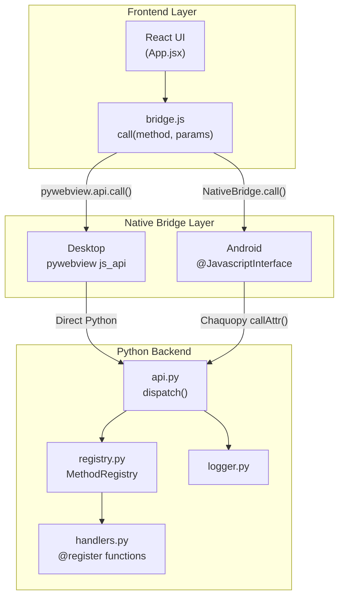
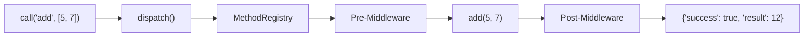
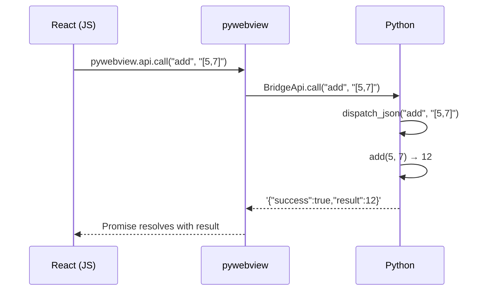
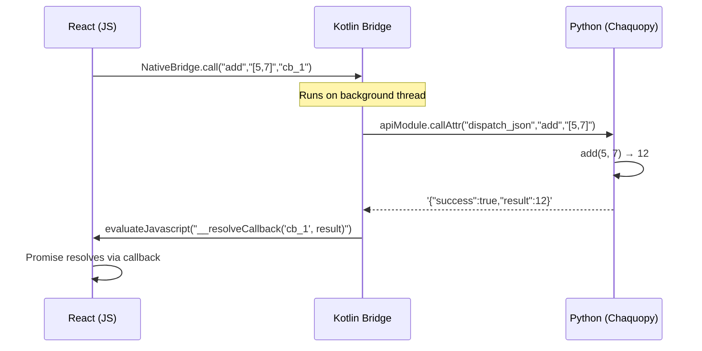

# Architecture

PyWebApp uses a layered architecture where each layer has a single responsibility. The key insight: **a single `call(method, params)` contract** connects everything.

## System Overview



## Layer Responsibilities

### 1. Frontend Layer (React + Vite)

| Component | File | Responsibility |
|-----------|------|----------------|
| UI | `App.jsx` | User interface, state management |
| Bridge | `bridge.js` | Platform detection, IPC abstraction |
| Components | `components/` | Reusable UI elements |

The frontend is **platform-agnostic**. It never knows if it's running in pywebview, an Android WebView, or a browser. The `bridge.js` module handles all platform detection.

### 2. Native Bridge Layer

This is the thinnest possible layer — its only job is to shuttle `call(method, paramsJson)` between JS and Python:

| Platform | Mechanism | File |
|----------|-----------|------|
| Desktop | `pywebview.api.call()` → direct Python | `desktop/bridge.py` |
| Android | `@JavascriptInterface` → Chaquopy `callAttr()` | `PythonBridge.kt` |

::: tip Why a thin bridge?
By keeping the bridge layer thin (one method), you never need to modify it when adding new Python functions. All routing happens in Python's dispatcher.
:::

### 3. Python Backend

The backend is 100% platform-independent:



| Component | File | Responsibility |
|-----------|------|----------------|
| Dispatcher | `api.py` | Routes method calls, error handling |
| Registry | `registry.py` | `@register` decorator, middleware, introspection |
| Handlers | `handlers.py` | Business logic functions |
| Logger | `logger.py` | Cross-platform file + console logging |

## IPC Contract

Every IPC call follows this contract:

**Request:**
```typescript
call(method: string, params: any[]): Promise<Response>
```

**Response:**
```typescript
interface Response {
  success: boolean;
  result?: any;     // Present on success
  error?: string;   // Present on failure
  method: string;   // Echo of called method
}
```

## Data Flow: Desktop vs Android

### Desktop (pywebview)



**Key point:** Everything runs in the **same process**. The call is essentially a Python function call — sub-millisecond latency.

### Android (Chaquopy)



**Key point:** Python runs on a **background thread** (thread pool of 4) to avoid blocking the Android UI thread. Results are posted back via `evaluateJavascript()`.

## Directory Map

```
pywebapp/
├── frontend/          ← Platform-agnostic React UI
├── backend/           ← Platform-agnostic Python logic
├── desktop/           ← Thin pywebview host
├── android/           ← Thin Kotlin + Chaquopy host
├── docs/              ← This documentation site
├── scripts/           ← Build & dev tooling
└── tests/             ← Python test suite
```
