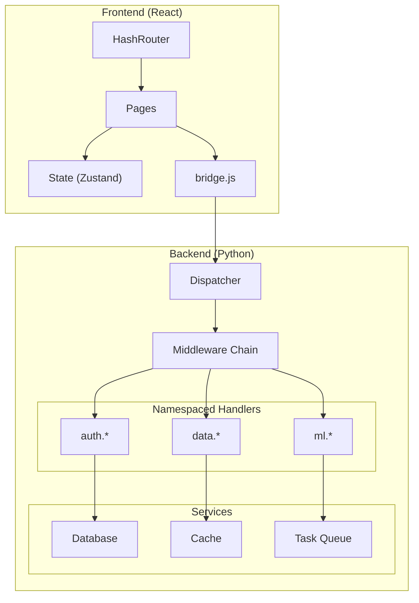

# Scaling Your App

PyWebApp is designed as a framework foundation. Here's how to scale it from a demo to a production application.

## Scaling the Backend

### Multi-Module Handlers

Split handlers by domain:

```
backend/
├── handlers/
│   ├── __init__.py
│   ├── auth.py          # @register(namespace="auth")
│   ├── storage.py       # @register(namespace="storage")
│   ├── ml.py            # @register(namespace="ml")
│   └── settings.py      # @register(namespace="settings")
├── services/
│   ├── database.py      # Data layer
│   └── cache.py         # Caching layer
├── api.py
├── registry.py
└── logger.py
```

```python
# backend/handlers/auth.py
from ..registry import register

@register(namespace="auth", description="Login with credentials")
def login(username: str, password: str) -> dict:
    # ... authentication logic
    return {"token": "...", "user": username}

@register(namespace="auth", description="Validate session token")
def validate(token: str) -> dict:
    # ... token validation
    return {"valid": True, "user": "..."}
```

```javascript
// Frontend
await call('auth.login', ['admin', 'password123']);
await call('auth.validate', ['token_abc']);
```

### Adding Middleware

Use middleware for cross-cutting concerns:

```python
from backend.registry import method_registry

# Logging middleware
def log_middleware(method, params):
    print(f"[IPC] {method}({params})")

# Timing middleware
import time
def timing_middleware(method, params, result):
    # result is the return value
    print(f"[IPC] {method} completed")

# Auth middleware
def auth_middleware(method, params):
    if method.startswith("admin."):
        # Check auth token (passed as last param or from context)
        pass

method_registry.add_pre_middleware(log_middleware)
method_registry.add_pre_middleware(auth_middleware)
method_registry.add_post_middleware(timing_middleware)
```

### Database Integration

```python
# backend/services/database.py
import sqlite3
import os

_db_path = None
_connection = None

def init_db(path: str):
    global _db_path, _connection
    _db_path = path
    _connection = sqlite3.connect(path, check_same_thread=False)
    _connection.row_factory = sqlite3.Row
    return _connection

def get_db():
    return _connection
```

```python
# backend/handlers/storage.py
from ..registry import register
from ..services.database import get_db

@register(namespace="storage", description="Save a key-value pair")
def save(key: str, value: str) -> dict:
    db = get_db()
    db.execute("INSERT OR REPLACE INTO kv (key, value) VALUES (?, ?)", (key, value))
    db.commit()
    return {"saved": True, "key": key}
```

## Scaling the Frontend

### Adding Pages with React Router

```jsx
// Use HashRouter for WebView compatibility
import { HashRouter, Routes, Route } from 'react-router-dom';

function App() {
  return (
    <HashRouter>
      <Routes>
        <Route path="/" element={<Home />} />
        <Route path="/settings" element={<Settings />} />
        <Route path="/dashboard" element={<Dashboard />} />
      </Routes>
    </HashRouter>
  );
}
```

::: tip Use HashRouter, not BrowserRouter
WebViews loading from `file://` protocol can't handle HTML5 history API. Always use `HashRouter` for client-side routing.
:::

### State Management

For complex apps, add a state manager:

```bash
npm install zustand  # Lightweight, no boilerplate
```

```jsx
import { create } from 'zustand';

const useStore = create((set) => ({
  user: null,
  setUser: (user) => set({ user }),
  results: {},
  addResult: (method, result) => set((state) => ({
    results: { ...state.results, [method]: result }
  })),
}));
```

## Scaling Architecture



## Performance Optimization

### Python Side
- Use `lru_cache` for expensive computations
- Process heavy work in background threads
- Use connection pooling for databases

### Frontend Side
- Lazy-load pages with `React.lazy()`
- Use `React.memo()` for expensive components
- Debounce rapid IPC calls from UI

### Bundle Size
- Tree-shake unused dependencies
- Use dynamic imports for large libraries
- Analyze with `npx vite-bundle-visualizer`
