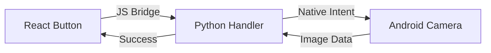

# 🚀 Tutorial: Build Your First App

In this tutorial, we will build a **Real-Time Camera Dashboard** using the PyWebApp Native framework.

## 🏁 Prerequisites
- Python 3.8+
- Node.js 16+
- Your Android device (for testing native features)

---

## 🛠️ Step 1: Installation & Setup
First, install the framework globally using `pip`. Note that while the package is named `pywebapp-native`, the CLI command you use is `pywebapp`.

```bash
pip install pywebapp-native
```

Then, run the command to scaffold your new masterpiece:
```bash
pywebapp init CameraApp
cd CameraApp

# Install React dependencies
cd frontend
npm install
cd ..
```

## 🏗️ Step 2: The Logic (Python)
Open `backend/handlers.py` and register a new camera method:
```python
@register("take_photo")
def take_photo(params):
    # This calls the native system camera
    return bridge.call_native("CAMERA_CAPTURE")
```

## 🎨 Step 3: The UI (React)
Open `frontend/src/App.jsx` and add a button:
```javascript
import { call } from './bridge'

function App() {
  const handleCapture = async () => {
    const result = await call("take_photo");
    console.log("Photo Captured!", result);
  };

  return <button onClick={handleCapture}>📸 Capture Photo</button>;
}
```

## 🏎️ Step 4: Run it!
```bash
pywebapp dev
```

---

## 📦 Step 5: Build for Production
Once you are happy, build your native APK:
```bash
pywebapp build-android
```


